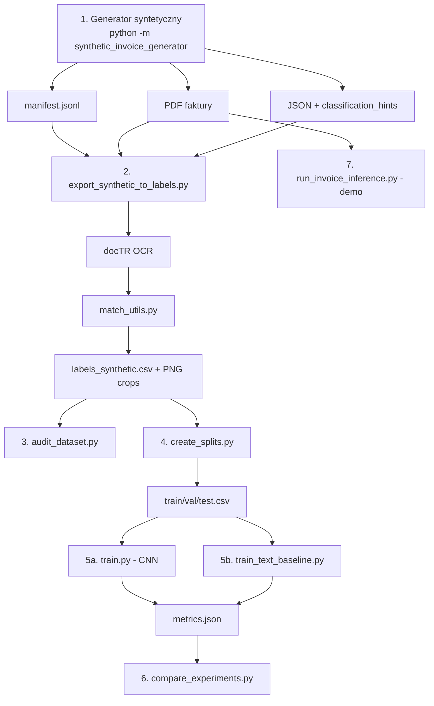
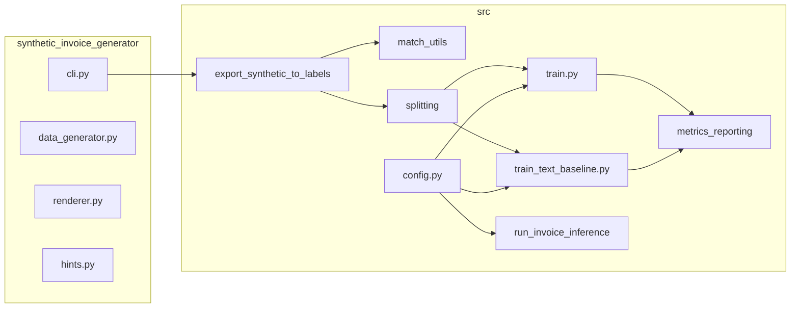

# Raport techniczny projektu AI_OCR
## Materiał do pracy magisterskiej — Informatyka, Uczenie maszynowe i sztuczna inteligencja

---

## 1. Ogólny opis projektu

### Problem i cel

Projekt **AI_OCR** rozwiązuje problem **automatycznego przypisywania klasy semantycznej do pojedynczych linii tekstu** wyodrębnionych z faktur PDF w stylu polskim. Główny cel aplikacji to **badawcze porównanie metod uczenia maszynowego** na tym samym zbiorze danych: sieci konwolucyjnej na obrazach linii oraz modeli tekstowych TF-IDF + klasyfikator liniowy na tekście z OCR.

Źródło: [README.md](README.md) (sekcje 1–3), [PROJECT_CURRENT_STATE.md](PROJECT_CURRENT_STATE.md).

### Zakres tematyczny

| Aspekt | Czy dotyczy projektu? | Uwagi |
|--------|----------------------|-------|
| OCR | **Tak** | docTR (`python-doctr`), wstępnie wytrenowany |
| Odczyt faktur | **Częściowo** | Klasyfikacja linii, nie pełna ekstrakcja pól do JSON |
| Paragony | **Nie** | Brak w kodzie |
| Dokumenty księgowe | **Tak (faktury)** | Syntetyczne faktury VAT, 3 layouty HTML |
| Ekstrakcja danych | **Częściowo** | Reguły w `match_utils.py` tylko do **etykietowania** eksportu; inferencja nie zwraca strukturalnego JSON |

### Dane wejściowe

- **PDF faktur** — syntetyczne (`synthetic_invoice_generator`) lub własne (`data/raw/` do demo)
- **Manifest JSONL** — indeks faktur z ścieżkami do PDF i JSON ([`manifest.jsonl`](synthetic_output/batch_100_v2/manifest.jsonl))
- **Pliki JSON z ground truth** — `classification_hints`, pełna struktura faktury
- **CSV z etykietami** — `labels_synthetic.csv` (4656 wierszy, 100 faktur)
- **Obrazy cropów linii** — PNG w `data/images_synthetic/` (gitignored, generowane lokalnie)

### Dane wyjściowe

- **CSV etykiet** — `filename`, `text`, `label`, `invoice_id`, `semantic_name`
- **Artefakty ML** — `model.pth` (CNN), `model.joblib` (tekst), `metrics.json`, macierze pomyłek CSV
- **Porównanie eksperymentów** — `experiment_comparison_*.csv`
- **Inferencja demo** — `predictions.csv` z `line_no`, `text`, etykiety, `crop_path`
- **Wizualizacje** — SVG/PNG dla plakatu (`docs/poster_assets/`)

### Sens biznesowy

Projekt można przedstawić jako **element systemu wspierającego automatyzację księgowości** — pierwszy etap pipeline'u: rozpoznanie *typu* linii (NIP, data, kwota) zamiast gotowego systemu ERP. README wyraźnie stwierdza, że **nie jest** gotowym systemem księgowym ani narzędziem pełnej ekstrakcji strukturalnej z walidacją NIP/kwot/dat, bez integracji z KSeF.

### Podsumowanie

System wspiera **automatyzację analizy dokumentów księgowych** na poziomie **klasyfikacji semantycznej linii OCR**, co stanowi fundament pod dalszą ekstrakcję pól — ale sama ekstrakcja wartości pól w inferencji **nie jest zaimplementowana**.

---

## 2. Możliwe tematy pracy magisterskiej (5 propozycji)

1. **Porównanie metod klasyfikacji semantycznej linii faktur: sieć konwolucyjna na obrazach linii vs modele TF-IDF na tekście OCR**
   - Bezpośrednio odzwierciedla architekturę projektu (`train.py`, `train_text_baseline.py`).

2. **Automatyczne budowanie zbioru treningowego dla OCR faktur z wykorzystaniem generatora syntetycznych dokumentów i regułowego dopasowania etykiet**
   - Obejmuje `synthetic_invoice_generator/`, `export_synthetic_to_labels.py`, `match_utils.py`.

3. **Wpływ niezbalansowania klas (dominacja OTHER) na skuteczność klasyfikacji linii faktur — analiza wag klas, downsamplingu i metryk macro F1**
   - 83% linii to OTHER ([`labels_synthetic_summary.json`](data/labels_synthetic_summary.json)); eksperymenty z `--use-class-weights` i `--downsample-label`.

4. **Ocena jakości pipeline'u OCR docTR w kontekście klasyfikacji pól faktury polskiej — analiza błędów dopasowania regułowego i propagacji do modeli ML**
   - Błędy OCR wpływają na etykiety (match_utils) i na modele tekstowe; 60 niejednoznacznych dopasowań w eksporcie.

5. **Projekt i ewaluacja modułowego systemu przetwarzania faktur PDF jako etapu wstępnego do automatyzacji procesów księgowych (z perspektywą rozszerzenia o ekstrakcję pól i integrację z KSeF)**
   - Szerszy kontekst biznesowy z jawnymi ograniczeniami projektu względem KSeF.

---

## 3. Struktura projektu

### Drzewo katalogów (uproszczone)

```
AI_OCR/
├── src/                          # Główny pipeline ML/OCR
├── synthetic_invoice_generator/  # Generator PDF+JSON
├── data/                         # Zbiory etykiet i obrazy
├── synthetic_output/             # Ground truth JSON (100 faktur × 2 batche)
├── output/                       # Eksperymenty (gitignored)
├── docs/                         # Dokumentacja techniczna
├── models/                       # Legacy checkpointy
├── README.md, EXPERIMENTS.md
└── requirements.txt
```

### Najważniejsze pliki — tabela

| Ścieżka | Funkcja | Istotność dla pracy |
|---------|---------|---------------------|
| [src/config.py](src/config.py) | Taksonomia 12 klas, IMG_SIZE=128 | Definicja problemu klasyfikacji |
| [src/export_synthetic_to_labels.py](src/export_synthetic_to_labels.py) | OCR docTR + etykietowanie regułowe | Pipeline danych treningowych |
| [src/match_utils.py](src/match_utils.py) | Reguły dopasowania OCR↔JSON | Metoda regułowa (ground truth) |
| [src/model.py](src/model.py) | Architektura InvoiceCNN | Model deep learning |
| [src/train.py](src/train.py) | Trening CNN | Eksperyment obrazowy |
| [src/train_text_baseline.py](src/train_text_baseline.py) | TF-IDF + LogReg/LinearSVC | Eksperyment tekstowy |
| [src/metrics_reporting.py](src/metrics_reporting.py) | Metryki klasyfikacji | Ewaluacja |
| [src/splitting.py](src/splitting.py) | Podział dokumentowy 70/15/15 | Metodologia walidacji |
| [src/run_invoice_inference.py](src/run_invoice_inference.py) | Inferencja na jednym PDF | Demo systemu |
| [synthetic_invoice_generator/cli.py](synthetic_invoice_generator/cli.py) | Generowanie faktur | Dane syntetyczne |
| [synthetic_invoice_generator/hints.py](synthetic_invoice_generator/hints.py) | classification_hints | Ground truth |
| [data/labels_synthetic.csv](data/labels_synthetic.csv) | 4656 etykietowanych linii | Zbiór treningowy |
| [docs/RESULTS_SUMMARY.md](docs/RESULTS_SUMMARY.md) | Wstępne metryki | Wyniki eksperymentów |
| [src/run_multi_seed_experiments.py](../src/run_multi_seed_experiments.py) | Multi-seed: splity + trening + agregacja | Powtarzalność badań |
| [src/eval_field_extraction.py](../src/eval_field_extraction.py) | Metryki exact match pól vs JSON | Rozszerzenie ewaluacji |
| [docs/DATA_VERIFICATION.md](DATA_VERIFICATION.md) | Weryfikacja lokalnych danych | Przygotowanie danych |
| [docs/MULTI_SEED_RESULTS.md](MULTI_SEED_RESULTS.md) | Wyniki 3 seedów | Eksperymenty |

### Moduły wg funkcji

- **Odczyt dokumentów:** `export_synthetic_to_labels.py`, `run_invoice_inference.py`, `OCR.py` (legacy)
- **OCR:** docTR we wszystkich powyższych; brak alternatywnych silników OCR
- **Przetwarzanie danych:** `experiment_prep.py`, `splitting.py`, `audit_dataset.py`
- **Modele ML:** `model.py`, `train.py`, `train_text_baseline.py`, `invoice_dataset.py`
- **Zapis wyników:** `metrics_reporting.py`, `compare_experiments.py`, CSV/JSON w `output/`
- **Wizualizacja:** `plot_class_distribution_for_poster.py`, `visualize_invoice_lines_for_poster.py`, Mermaid w `docs/poster_assets/`

---

## 4. Technologie i biblioteki

### Pliki zależności

| Plik | Zawartość |
|------|-----------|
| [requirements.txt](requirements.txt) | torch, torchvision, pandas, numpy, scikit-learn, joblib, Pillow, matplotlib, python-doctr |
| [synthetic_invoice_generator/requirements.txt](synthetic_invoice_generator/requirements.txt) | Jinja2, WeasyPrint, Faker, pytest |

**Brak:** `setup.py`, `pyproject.toml`, `Pipfile`, `environment.yml`.

### Biblioteki — szczegółowa tabela

| Biblioteka | Zastosowanie | Pliki | Znaczenie badawcze |
|------------|--------------|-------|-------------------|
| **python-doctr** | OCR: detekcja + rozpoznanie tekstu, PDF→linie | `export_synthetic_to_labels.py`, `run_invoice_inference.py`, `OCR.py` | **Wysokie** — jedyny silnik OCR |
| **PyTorch** | CNN, trening, inferencja | `model.py`, `train.py`, `run_invoice_inference.py` | **Wysokie** — deep learning |
| **torchvision** | Transformacje obrazu (Grayscale, Resize, ToTensor) | `invoice_dataset.py`, `run_invoice_inference.py` | Średnie |
| **scikit-learn** | TF-IDF, LogReg, LinearSVC, metryki, class weights | `train_text_baseline.py`, `metrics_reporting.py`, `train.py` | **Wysokie** — baseline ML |
| **pandas** | CSV, DataFrames | Wszystkie skrypty pipeline'u | Średnie |
| **numpy** | Operacje numeryczne, splity | `splitting.py`, `metrics_reporting.py` | Średnie |
| **joblib** | Serializacja modeli tekstowych | `train_text_baseline.py`, `run_invoice_inference.py` | Średnie |
| **Pillow (PIL)** | Cropy linii, zapis PNG | OCR skrypty, `invoice_dataset.py` | Średnie |
| **matplotlib** | Wykresy rozkładu klas, plakat | `plot_class_distribution_for_poster.py` | Niskie–średnie (wizualizacja) |
| **Jinja2** | Szablony HTML faktur | `synthetic_invoice_generator/renderer.py` | Niskie (generator danych) |
| **WeasyPrint** | HTML→PDF | `synthetic_invoice_generator/renderer.py` | Niskie |
| **Faker** | Dane syntetyczne (NIP, nazwy, kwoty) | `synthetic_invoice_generator/data_generator.py` | Niskie |
| **pytest** | Testy generatora | `synthetic_invoice_generator/tests/` | Niskie |

### Biblioteki NIE występujące w projekcie

Tesseract, EasyOCR, PaddleOCR, OpenCV, Transformers/BERT, spaCy, plotly, openpyxl/Excel, bazy danych, API REST, pdfplumber/PyMuPDF.

---

## 5. Przepływ działania programu

### Krok po kroku (pipeline badawczy)



### Szczegóły etapów

1. **Generacja** — Faker tworzy dane faktury; Jinja2 renderuje HTML (layout_a/b/c); WeasyPrint generuje PDF; JSON z `classification_hints` trafia do `synthetic_output/`.
2. **Eksport etykiet** — docTR czyta PDF (`DocumentFile.from_pdf`), wykrywa linie (bloki→linie→słowa), wycinane są cropy PNG, tekst linii dopasowywany regułowo do hints.
3. **Audyt** — weryfikacja brakujących obrazów, rozkładu klas, liczby dokumentów.
4. **Split** — podział **na poziomie dokumentu** (`invoice_id`), 70/15/15, seed=42.
5. **Trening** — CNN na cropach 128×128 lub TF-IDF na kolumnie `text`; opcjonalnie wykluczenie CURRENCY (id 10), wagi klas, downsampling OTHER.
6. **Porównanie** — agregacja `metrics.json` z katalogów `exp_*`.
7. **Inferencja demo** — jeden PDF, OCR, klasyfikacja CNN lub text, zapis `predictions.csv` **bez metryk** (brak etykiet referencyjnych).

### Wstępne przetwarzanie obrazu

- **Przed OCR:** brak (docTR wewnętrznie rasteruje PDF)
- **Po OCR (CNN):** Grayscale → Resize(128×128) → ToTensor
- **Filtrowanie:** bbox < 10px pomijane

### Możliwe błędy

- Brak PDF/JSON w manifeście → pominięcie faktury
- Błąd OCR → `ocr_errors` w summary (0 w obecnym eksporcie)
- Niejednoznaczne dopasowanie reguł → OTHER (60 przypadków)
- Brak obrazów cropów → błąd treningu (`FileNotFoundError`)
- Niedopasowanie liczby klas modelu vs checkpoint → błąd inferencji

### Diagram przepływu danych (do pracy)

Gotowy szablon Mermaid: [docs/poster_assets/source/pipeline_ai_ocr.mmd](docs/poster_assets/source/pipeline_ai_ocr.mmd).

---

## 6. Metody odczytu danych

### 6.1 OCR — docTR (wstępnie wytrenowany)

| Aspekt | Opis |
|--------|------|
| **Działanie** | Detekcja tekstu + rozpoznanie znaków; hierarchia page→blocks→lines→words |
| **Implementacja** | `ocr_predictor(pretrained=True)` w `export_synthetic_to_labels.py`, `run_invoice_inference.py` |
| **Wejście** | Plik PDF |
| **Wyjście** | Tekst linii + geometria bbox (znormalizowane współrzędne słów) |
| **Zalety** | End-to-end, obsługa PDF, brak konfiguracji Tesseract |
| **Ograniczenia** | Tylko strona 0; nie trenowany w repo; brak porównania z innymi OCR |
| **Porównanie w pracy** | Można dodać Tesseract/EasyOCR jako rozszerzenie (propozycja) |

### 6.2 Reguły tekstowe — match_utils.py

| Aspekt | Opis |
|--------|------|
| **Działanie** | Wielopoziomowe dopasowanie (tiery 0–5): exact value, NIP digits, kwoty PL, daty, substring; remisy → OTHER |
| **Implementacja** | `match_ocr_line()`, `try_parse_amount()`, `try_parse_date_iso()`, `digits_only()` |
| **Wejście** | Tekst linii OCR + `classification_hints` z JSON |
| **Wyjście** | `MatchDecision(semantic, matched_value, match_type, reason)` |
| **Zalety** | Interpretowalne, konserwatywne, deterministyczne |
| **Ograniczenia** | Tylko do etykietowania eksportu; nie używane w inferencji; zależne od jakości OCR |
| **Porównanie w pracy** | Baseline regułowy vs ML; analiza 60 ambiguous matches |

### 6.3 Regex

- Waluta: `(?i)(?:\bpln\b|\bzł\b|\bzl\b|\beur\b|\busd\b)` w `export_synthetic_to_labels.py`
- NIP: `re.sub(r"\D", "")` w `match_utils.py`
- Kwoty: parsowanie formatu `1.234,56` w `try_parse_amount()`

### 6.4 CNN — InvoiceCNN (deep learning)

| Aspekt | Opis |
|--------|------|
| **Działanie** | 2× Conv2d(1→32→64) + MaxPool → Flatten → Linear(128) → Linear(K klas) |
| **Implementacja** | [src/model.py](src/model.py) |
| **Wejście** | Tensor (B, 1, 128, 128) — szary crop linii |
| **Wyjście** | Logity (B, num_classes) |
| **Zalety** | Wykorzystuje layout/czcionkę, niezależny od poprawności każdego słowa OCR |
| **Ograniczenia** | Mała sieć; tylko pierwsza strona; wrażliwy na jakość cropu |
| **Porównanie w pracy** | **Główna metoda badawcza** |

### 6.5 TF-IDF + klasyfikator liniowy (ML klasyczne)

| Aspekt | Opis |
|--------|------|
| **Działanie** | Wektoryzacja n-gramów (sublinear_tf) + LogisticRegression lub LinearSVC |
| **Implementacja** | [src/train_text_baseline.py](src/train_text_baseline.py) `_build_pipeline()` |
| **Wejście** | String tekstu OCR linii |
| **Wyjście** | Etykieta klasy (0..K-1) |
| **Zalety** | Szybki trening; dobrze wykorzystuje słowa kluczowe („NIP”, „Razem”) |
| **Ograniczenia** | Zależny od jakości OCR; brak kontekstu layoutu |
| **Porównanie w pracy** | **Główna metoda badawcza** |

### Metody NIE zaimplementowane

Transformery, modele językowe, szablony pozycyjne (layoutLM), hybryda obraz+tekst, ekstrakcja pól na inferencji.

---

## 7. Modele uczenia maszynowego / AI

### Używane modele

| Model | Typ | Trenowany lokalnie? | Plik |
|-------|-----|---------------------|------|
| docTR OCR | Pretrained DL | **Nie** (frozen) | docTR API |
| InvoiceCNN | CNN (PyTorch) | **Tak** | `train.py` → `output/exp_*/model.pth` |
| TF-IDF + LogReg | ML klasyczne | **Tak** | `train_text_baseline.py` |
| TF-IDF + LinearSVC | ML klasyczne | **Tak** | `train_text_baseline.py` |

### Dane treningowe

- **4656 linii** z **100 faktur** syntetycznych ([`labels_synthetic_summary.json`](data/labels_synthetic_summary.json))
- Podział dokumentowy 70/15/15 (~70/15/15 faktur)
- Etykiety pochodzą z regułowego dopasowania OCR do JSON hints (nie ręczne)

### Cechy (features)

- **CNN:** piksele cropu 128×128 (1 kanał, szary)
- **Tekst:** n-gramy z kolumny `text` (domyślnie bigramy; parametry `--ngram-min/max`)

### Klasy / etykiety

12 klas w [config.py](src/config.py); eksperymenty główne: **11 aktywnych** (CURRENCY id=10 wykluczone — 0 wierszy w eksporcie).

### Metryki liczone

- accuracy, macro F1, weighted F1
- per-class: precision, recall, F1, support
- confusion matrix (val + test)

Implementacja: [`metrics_reporting.py`](src/metrics_reporting.py) `compute_split_metrics()`.

### Wyniki multi-seed (3 seedy, N=100, splity zregenerowane)

Źródło: [docs/MULTI_SEED_RESULTS.md](MULTI_SEED_RESULTS.md), `output/multi_seed/multi_seed_summary.json`.

| Model | val_macro_f1 (mean±std) | test_accuracy (mean±std) | test_macro_f1 (mean±std) |
|-------|-------------------------|--------------------------|--------------------------|
| CNN + class weights | 0.6569 ± 0.0067 | 0.8771 ± 0.0265 | **0.6758 ± 0.0275** |
| TF-IDF + LogReg | 0.6024 ± 0.0090 | 0.8381 ± 0.0212 | 0.6083 ± 0.0179 |
| TF-IDF + LinearSVC | 0.6286 ± 0.0113 | **0.9246 ± 0.0150** | 0.6261 ± 0.0328 |

**Uwaga:** Starsze wyniki w [RESULTS_SUMMARY.md](RESULTS_SUMMARY.md) pochodziły m.in. z nieaktualnego splitu (10 dokumentów). Używać `output/multi_seed/` jako źródła prawdy po weryfikacji z [DATA_VERIFICATION.md](DATA_VERIFICATION.md).

### Powtarzalność eksperymentu

Protokół w [EXPERIMENTS.md](EXPERIMENTS.md):
1. `python -m synthetic_invoice_generator --count 100 --seed 42`
2. `python src/export_synthetic_to_labels.py ...`
3. `python src/create_splits.py ...`
4. `python src/train.py ...` / `python src/train_text_baseline.py ...`
5. `python src/run_multi_seed_experiments.py --seeds 42 123 456` — multi-seed (patrz `output/multi_seed/`)

Seeds: random, numpy, torch ustawiane w `train.py` (`_set_seed()`).

### Rozszerzenie o ML/AI (propozycja)

- Fine-tuning docTR na fakturach
- BERT polski (HerBERT) do klasyfikacji linii
- LayoutLM / Donut do ekstrakcji pól
- Model hybrydowy: concat(CNN features, TF-IDF)
- CRNN na cropach z sekwencją znaków

---

## 8. Dane i zbiór testowy

### Dostępne dane (w repozytorium)

| Zasób | Liczba | Typ | W repo? |
|-------|--------|-----|---------|
| Faktury syntetyczne JSON | 100 (batch_100_v2) + 100 (batch_100) | Ground truth | **Tak** (JSON) |
| PDF syntetyczne | 100 | PDF | **Tak lokalnie** (`synthetic_output/batch_100_v2/pdfs/`, gitignored) |
| Linie etykietowane | 4656 | CSV | **Tak** |
| Cropy PNG | 4656 | Obraz | **Tak lokalnie** (`data/images_synthetic/`, gitignored) |
| Legacy manual | ~893 linii | CSV (`labels.csv`) | **Tak** |
| Wyniki eksperymentów | 13 katalogów exp_* | JSON/CSV | **Nie** (gitignored) |

### Pola odczytywane (semantycznie, nie wartości)

SELLER_NAME, SELLER_NIP, BUYER_NAME, BUYER_NIP, TOTAL_PRICE, INVOICE_NUMBER, INVOICE_DATE, SALE_DATE, NET_AMOUNT, VAT_AMOUNT, CURRENCY, OTHER.

### Dane referencyjne

- **JSON syntetyczny** — pełna struktura faktury + `classification_hints` z `canonical_value` i `rendered_value`
- **CSV review** — `labels_synthetic_review.csv` z `match_type`, `reason`, `matched_value`
- **Metryki ekstrakcji pól** — [`eval_field_extraction.py`](../src/eval_field_extraction.py) + [`output/field_extraction_metrics.json`](../output/field_extraction_metrics.json) (exact match vs JSON; NIP 100%, daty 0% przy liniach z captionem)

### Czy można policzyć accuracy/precision/recall/F1?

- **Tak — na poziomie linii/klasy** — `metrics_reporting.py`
- **Tak — exact match wartości pól** — `eval_field_extraction.py` (na etykietach ground-truth, nie na inferencji modelu)
- **Nie w inferencji produkcyjnej** — `run_invoice_inference.py` nie buduje JSON faktury

### Propozycja tabeli referencyjnej (do rozszerzenia pracy)

| Kolumna | Opis |
|---------|------|
| filename | Nazwa pliku PDF |
| invoice_id | Identyfikator dokumentu |
| line_no | Numer linii OCR |
| text_ocr | Tekst rozpoznany |
| semantic_expected | Etykieta referencyjna |
| semantic_predicted | Etykieta modelu |
| method | cnn / text / rules |
| correct | 1/0 |
| invoice_number_gt | Z JSON (opcjonalnie) |
| seller_nip_gt | Z JSON (opcjonalnie) |
| net_amount_gt | Z JSON (opcjonalnie) |

### Propozycja struktury zbioru testowego (jeśli rozszerzyć)

- 100–500 faktur syntetycznych (train/val/test dokumentowy)
- 50–100 faktur rzeczywistych (anonimizowanych) z ręcznymi etykietami linii
- Osobny podzbiór: skany niskiej jakości, faktury zagraniczne, paragony

---

## 9. Metryki oceny skuteczności

### Metryki już zaimplementowane

| Metryka | Poziom | Plik |
|---------|--------|------|
| Accuracy | Linia | `metrics_reporting.py` |
| Macro F1 | Linia (wszystkie klasy równo) | `metrics_reporting.py` |
| Weighted F1 | Linia (ważone supportem) | `metrics_reporting.py` |
| Precision/Recall/F1 per class | Linia, per klasa | `classification_report` |
| Confusion matrix | Linia | CSV w `output/exp_*/` |

### Metryki rozszerzone (dodane w ramach raportu)

| Metryka | Skrypt | Uwagi |
|---------|--------|-------|
| Field-level exact match | `eval_field_extraction.py` | NIP 1.0; INVOICE_DATE/SALE_DATE 0.0 (caption w linii OCR) |
| Document-level all-fields | `eval_field_extraction.py` | 0/100 faktur w pełni poprawnych |

### Metryki NIE zaimplementowane

- CER/WER OCR
- Czas przetwarzania dokumentu (brak pomiaru w kodzie)
- Field-level na predykcjach modelu ML (wymaga pipeline inferencja → ekstrakcja)

### Rekomendacja dla pracy

| Metryka | Przydatność | Uzasadnienie |
|---------|-------------|--------------|
| **Macro F1** | **Najwyższa** | Klasy rzadkie (NIP, daty); OTHER dominuje — accuracy myląca |
| **Per-class F1** | **Wysoka** | Analiza słabych klas (SELLER_NAME: 45 linii) |
| **Weighted F1** | Średnia | Pokazuje wpływ OTHER |
| **Accuracy** | Uzupełniająca | README ostrzega: wysoka przy słabej rare-class |
| **Document-level accuracy** | Propozycja | % faktur z poprawnymi wszystkimi polami |
| **Field extraction EM** | Propozycja | Wymaga rozszerzenia inferencji |
| **Czas przetwarzania** | Propozycja | Porównanie CNN vs text vs OCR |

---

## 10. Propozycja eksperymentów badawczych

### E1: Porównanie CNN vs TF-IDF (LogReg vs LinearSVC)

- **Cel:** Główny wynik pracy — która modalność lepsza?
- **Dane:** labels_synthetic.csv, split 70/15/15, seed 42
- **Metody:** InvoiceCNN, TF-IDF+LogReg, TF-IDF+LinearSVC
- **Metryki:** macro F1 (val/test), per-class F1, accuracy
- **Tabele:** Tabela 1 — porównanie metod (jak w RESULTS_SUMMARY)
- **Wykresy:** Słupki macro F1; heatmapa confusion matrix
- **Rozdział:** Eksperymenty, Wyniki

### E2: Wpływ wykluczenia CURRENCY i downsamplingu OTHER

- **Cel:** Analiza niezbalansowania (83% OTHER)
- **Metody:** CNN z/bez `--use-class-weights`, z/bez `--downsample-label 11 --downsample-ratio 3`
- **Metryki:** macro F1 per-class, support
- **Wykresy:** Rozkład klas przed/po; F1 rare classes
- **Rozdział:** Analiza danych, Eksperymenty

### E3: Wpływ liczby dokumentów treningowych

- **Cel:** Krzywa uczenia — N ∈ {50, 100, 200, 500}
- **Dane:** Regeneracja generatora z różnym `--count`
- **Metryki:** val macro F1 vs N
- **Wykresy:** Linia F1(N)
- **Rozdział:** Eksperymenty (propozycja — wymaga uruchomienia)

### E4: Analiza błędów regułowego dopasowania (match_utils)

- **Cel:** Jakość ground truth — 60 ambiguous, 3876 OTHER
- **Dane:** labels_synthetic_review.csv
- **Metryki:** match_rate_non_other (16.75%), reason distribution
- **Wykresy:** Pie chart powodów OTHER
- **Rozdział:** Przygotowanie danych, Analiza błędów

### E5: Porównanie jakości OCR (propozycja rozszerzenia)

- **Cel:** docTR vs Tesseract vs EasyOCR
- **Metryki:** CER na liniach z ground truth text; downstream macro F1
- **Rozdział:** Metody OCR (propozycja — nie ma w kodzie)

### E6: Wpływ layoutu faktury

- **Cel:** layout_a vs layout_b vs layout_c (z meta JSON)
- **Metryki:** F1 per template
- **Dane:** Kolumna template_id z JSON meta
- **Rozdział:** Eksperymenty (propozycja — wymaga agregacji)

### E7: Czas przetwarzania

- **Cel:** OCR vs CNN vs text inference per document
- **Metryka:** średni czas [s/dokument]
- **Implementacja:** propozycja — dodać `time.perf_counter()` w `run_invoice_inference.py`

---

## 11. Tabele i wykresy do pracy magisterskiej

### Tabele opisujące dane

| Nazwa | Kolumny | Rozdział |
|-------|---------|----------|
| T1. Taksonomia klas | ID, nazwa, opis, liczba linii | Przygotowanie danych |
| T2. Statystyki zbioru | N faktur, N linii, % OTHER, N ambiguous | Przygotowanie danych |
| T3. Podział train/val/test | Split, N docs, N linii, rozkład klas | Metodologia |

### Tabele porównujące metody

| Nazwa | Kolumny | Rozdział |
|-------|---------|----------|
| T4. Porównanie modeli | Model, input, val_acc, val_macro_f1, test_acc, test_macro_f1 | Wyniki |
| T5. Per-class F1 | Klasa × Model (CNN, LogReg, SVC) | Wyniki |

### Tabele wyników

| Nazwa | Kolumny | Rozdział |
|-------|---------|----------|
| T6. Confusion matrix (fragment) | true × pred dla wybranych klas | Analiza błędów |
| T7. Przykłady błędnych klasyfikacji | text, true, pred, crop_path | Analiza błędów |

### Wykresy

| Nazwa | Osie | Źródło | Rozdział |
|-------|------|--------|----------|
| W1. Rozkład klas | Klasa × liczba | labels_synthetic_summary | Przygotowanie danych |
| W2. Macro F1 per method | Metoda × F1 | metrics.json | Wyniki |
| W3. Per-class F1 grouped bar | Klasa × F1 × metoda | classification_report | Wyniki |
| W4. Confusion matrix heatmap | true vs pred | confusion_matrix_test.csv | Analiza błędów |
| W5. Czas przetwarzania | Metoda × czas [s] | propozycja pomiaru | Eksperymenty |
| W6. F1 vs liczba dokumentów | N × F1 | propozycja E3 | Eksperymenty |

### Diagramy

| Nazwa | Typ | Plik źródłowy | Rozdział |
|-------|-----|---------------|----------|
| D1. Pipeline end-to-end | flowchart | pipeline_ai_ocr.mmd | Architektura |
| D2. Architektura InvoiceCNN | block diagram | model.py | Implementacja |
| D3. Moduły src/ | component diagram | TECHNICAL_OVERVIEW | Architektura |
| D4. Tier matching | flowchart | match_utils.py | Metody regułowe |

---

## 12. Fragmenty kodu warte pokazania w pracy

### F1. Taksonomia klas
- **Plik:** [src/config.py](src/config.py)
- **Co wyjaśnić:** Definicja problemu wieloklasowego
- **Rozdział:** Opis problemu / Implementacja

### F2. Architektura CNN
- **Plik:** [src/model.py](src/model.py), klasa `InvoiceCNN`
- **Co wyjaśnić:** Warstwy conv, wymiary, liczba parametrów
- **Rozdział:** Metody ML

### F3. Transformacje obrazu
- **Plik:** [src/invoice_dataset.py](src/invoice_dataset.py), `__getitem__`
- **Co wyjaśnić:** Preprocessing przed CNN
- **Rozdział:** Implementacja

### F4. OCR i ekstrakcja linii
- **Plik:** [src/export_synthetic_to_labels.py](src/export_synthetic_to_labels.py), `get_line_bbox_pixels`, pętla OCR
- **Co wyjaśnić:** docTR API, join słów, crop bbox
- **Rozdział:** OCR / Pipeline

### F5. Regułowe dopasowanie
- **Plik:** [src/match_utils.py](src/match_utils.py), `match_ocr_line`, `try_parse_amount`
- **Co wyjaśnić:** Tiery dopasowania, obsługa PL kwot i NIP
- **Rozdział:** Przygotowanie danych

### F6. Pipeline TF-IDF
- **Plik:** [src/train_text_baseline.py](src/train_text_baseline.py), `_build_pipeline`
- **Co wyjaśnić:** n-gramy, LogReg vs LinearSVC
- **Rozdział:** Metody ML

### F7. Metryki
- **Plik:** [src/metrics_reporting.py](src/metrics_reporting.py), `compute_split_metrics`
- **Co wyjaśnić:** Macro vs weighted F1, per-class report
- **Rozdział:** Metodologia ewaluacji

### F8. Podział dokumentowy
- **Plik:** [src/splitting.py](src/splitting.py), `document_level_split`
- **Co wyjaśnić:** Dlaczego split po invoice_id (brak data leakage)
- **Rozdział:** Metodologia

### F9. Inferencja end-to-end
- **Plik:** [src/run_invoice_inference.py](src/run_invoice_inference.py), `main`
- **Co wyjaśnić:** OCR → crop → classify → CSV
- **Rozdział:** Demonstracja systemu

### F10. Generacja ground truth
- **Plik:** [synthetic_invoice_generator/hints.py](synthetic_invoice_generator/hints.py), `build_classification_hints`
- **Co wyjaśnić:** canonical vs rendered value
- **Rozdział:** Generator danych

---

## 13. Architektura projektu

### Główne moduły i zależności



### Ocena architektury

**Mocne strony:**
- Modularność: osobne skrypty CLI per etap
- Wspólne metryki (`metrics_reporting.py`) dla CNN i text
- Wspólne splity i `experiment_prep.py` — ułatwia porównanie metod
- Dokumentacja (README, EXPERIMENTS, TECHNICAL_OVERVIEW)
- Generator syntetyczny z testami pytest

**Słabe strony:**
- Brak formalnego pakietu Python (`setup.py`)
- Brak testów dla `src/`
- Brak abstrakcji „Classifier interface” — każda metoda ma osobny skrypt
- Inferencja nie obsługuje modeli z `--exclude-labels` bez ręcznej konfiguracji
- Brak unified benchmark runner
- Legacy skrypty (`OCR.py`, `inference.py`) mylące wobec głównego pipeline'u

**Rozszerzalność:**
- Dodanie nowej metody: nowy skrypt treningowy + wpis w `compare_experiments.py` — **umiarkowanie łatwe**
- Porównanie wyników: `compare_experiments.py` — **łatwe** (wymaga spójnego `metrics.json`)

---

## 14. Ograniczenia projektu (uzasadnione kodem)

| Ograniczenie | Uzasadnienie |
|--------------|--------------|
| Tylko pierwsza strona PDF | Wszystkie skrypty OCR używają `doc[0]` |
| Brak pełnej ekstrakcji pól | Inferencja zwraca etykiety linii, nie JSON faktury |
| Brak walidacji NIP (checksum) | `digits_only()` bez algorytmu kontrolnego |
| Dominacja OTHER (~83%) | `labels_synthetic_summary.json` |
| 0 linii CURRENCY | Waluta zlepiona z kwotami |
| Tylko dane syntetyczne w głównym pipeline | 100 faktur; brak real-world benchmark |
| Brak alternatywnych OCR | Tylko docTR |
| Brak modeli transformerowych | Brak w requirements i kodzie |
| PDF-y i cropy nie w repo | `.gitignore` |
| N=100, single seed | RESULTS_SUMMARY — metryki niestabilne |
| Brak paragonów | Generator i taksonomia dotyczą faktur |
| KSeF | README: brak integracji; faktury ustrukturyzowane XML — inny problem |
| Faktury zagraniczne | Generator: locale PL; captions polskie |
| Reguły tylko do etykietowania | `match_utils` nie w inferencji |
| Legacy vs main pipeline | `labels.csv` bez `invoice_id` — niekompatybilny split |

---

## 15. Możliwe kierunki rozwoju (propozycje)

1. **Ekstrakcja wartości pól** — po klasyfikacji linii: regex/parser per klasa → JSON faktury
2. **Paragony** — nowa taksonomia + generator uproszczonych layoutów
3. **Faktury zagraniczne** — wielojęzyczne captions, waluty, formaty dat
4. **Większy zbiór** — 500+ faktur, multi-seed, real scans
5. **Modele DL/NLP** — HerBERT, LayoutLM, Donut
6. **Porównanie OCR** — Tesseract, EasyOCR, PaddleOCR, Azure/Google API
7. **Raporty automatyczne** — notebook/HTML z metrykami po `compare_experiments`
8. **UI** — Streamlit/Gradio do upload PDF
9. **Integracja ERP** — export JSON/CSV do systemu księgowego
10. **KSeF jako kontekst** — structured XML vs OCR legacy PDF (rozdział porównawczy)

---

## 16. Propozycja struktury pracy magisterskiej (≥40 stron)

| Rozdział | Treść | Strony |
|----------|-------|--------|
| **1. Wstęp** | Cel, teza, struktura pracy | 2–3 |
| **2. Analiza problemu biznesowego** | Automatyzacja księgowości, faktury, KSeF (kontekst) | 4–5 |
| **3. Przegląd literatury** | OCR, Document AI, ekstrakcja pól, metryki | 6–8 |
| **4. Metody OCR i przetwarzania dokumentów** | docTR, segmentacja linii, preprocessing | 4–5 |
| **5. Metody uczenia maszynowego** | CNN, TF-IDF, klasyfikacja niezbalansowana | 5–6 |
| **6. Opis systemu AI_OCR** | Architektura, moduły, diagramy | 5–6 |
| **7. Implementacja** | Generator, export, modele, fragmenty kodu | 6–8 |
| **8. Przygotowanie danych testowych** | 100 faktur, etykiety, splity, statystyki | 3–4 |
| **9. Metodologia eksperymentów** | Protokół, metryki, środowisko | 3–4 |
| **10. Wyniki eksperymentów** | Tabele, wykresy, porównanie CNN vs text | 5–6 |
| **11. Analiza błędów** | Confusion matrix, OTHER, OCR errors | 3–4 |
| **12. Wnioski** | Odpowiedź na pytania badawcze | 2–3 |
| **13. Kierunki rozwoju** | Rozszerzenia, KSeF, real data | 2–3 |
| **Bibliografia** | | 2–3 |
| **Załączniki** | Kod, przykładowe faktury, pełne tabele | 5–10 |

**Razem:** ~45–55 stron (w tym 15–20 stron tabel, wykresów, kodu, diagramów).

---

## 17. Materiał źródłowy — opis akademicki (baza rozdziałów)

### 17.1 Cel systemu

System **AI_OCR** został zaprojektowany jako platforma badawcza do **semantycznej klasyfikacji linii tekstu** wyodrębnionych z polskich faktur PDF. W przeciwieństwie do komercyjnych rozwiązań ekstrakcji dokumentów, które zwracają ustrukturyzowany rekord faktury, niniejszy projekt koncentruje się na przypisaniu **klasy semantycznej** (np. NIP sprzedawcy, data wystawienia, kwota netto) do **każdej linii OCR** osobno. Umożliwia to porównanie metod uczenia maszynowego operujących na **różnych modalnościach danych**: reprezentacji pikselowej (crop linii) oraz reprezentacji tekstowej (łańcuch znaków z OCR).

### 17.2 Uzasadnienie problemu

Automatyczny odczyt dokumentów księgowych stanowi kluczowy element cyfryzacji procesów finansowych. Faktury PDF — szczególnie skany i dokumenty o zróżnicowanym układzie — wymagają połączenia technik OCR z metodami rozumienia struktury dokumentu. Projekt AI_OCR adresuje podproblem **identyfikacji typu informacji** zawartej w linii faktury, co stanowi etap pośredni przed pełną ekstrakcją wartości pól.

### 17.3 Zastosowane technologie

Pipeline opiera się na **Pythonie 3** z bibliotekami **PyTorch** (sieć CNN), **scikit-learn** (TF-IDF, klasyfikatory liniowe, metryki), **python-doctr** (OCR), **pandas** (zarządzanie danymi) oraz **WeasyPrint/Jinja2/Faker** (generator syntetycznych faktur). Projekt nie wykorzystuje modeli transformerowych ani zewnętrznych API chmurowych.

### 17.4 Sposób działania

Proces rozpoczyna się od wygenerowania partii syntetycznych faktur PDF wraz z plikami JSON zawierającymi ground truth (`classification_hints`). Skrypt `export_synthetic_to_labels.py` stosuje wstępnie wytrenowany model docTR do detekcji linii tekstu, wycina obrazy linii i dopasowuje tekst OCR do wartości referencyjnych za pomocą reguł w module `match_utils.py`. Powstały zbiór (4656 linii z 100 faktur) dzielony jest na zbiory treningowy, walidacyjny i testowy na poziomie dokumentu (70/15/15). Trenowane są trzy warianty klasyfikatora: CNN na cropach 128×128, TF-IDF + regresja logistyczna oraz TF-IDF + LinearSVC. Ewaluacja opiera się na accuracy, macro F1 i macierzach pomyłek.

### 17.5 Metody odczytu danych

W projekcie wyróżnić można trzy warstwy: (1) **OCR docTR** — ekstrakcja tekstu i geometrii; (2) **reguły tekstowe** — etykietowanie eksportu (NIP, kwoty PL, daty); (3) **klasyfikatory ML** — przypisanie klasy semantycznej w inferencji. Brak jest warstwy ekstrakcji wartości pól w trybie produkcyjnym.

### 17.6 Metryki i wyniki (multi-seed, N=100)

Po regeneracji splitów dokumentowych (70/15/15 faktur) i powtórzeniu eksperymentów dla seedów 42, 123, 456: **CNN osiąga najwyższy test macro F1** (~**0,676** ± 0,028), przewyższając TF-IDF + LogReg (~0,608) i LinearSVC (~0,626). **Accuracy test** pozostaje najwyższa dla LinearSVC (~0,925), co odzwierciedla dominację klasy OTHER. Szczegóły: [MULTI_SEED_RESULTS.md](MULTI_SEED_RESULTS.md).

### 17.7 Ograniczenia i wnioski techniczne

System nie stanowi gotowego narzędzia księgowego. Ograniczenia obejmują: syntetyczność danych, dominację klasy OTHER, brak obsługi wielostronicowych faktur, brak integracji z KSeF oraz brak porównania wielu silników OCR. Mimo to architektura modularna i jawny protokół eksperymentów czynią projekt solidną podstawą empiryczną pracy magisterskiej o porównaniu metod ML w kontekście automatycznego przetwarzania faktur.

---

## 18. Braki informacyjne

Poniższe informacje **nie da się jednoznacznie ustalić na podstawie kodu**:

| Informacja | Status |
|------------|--------|
| Dokładna liczba PDF-ów lokalnie | **100** w `synthetic_output/batch_100_v2/pdfs/` (gitignored) — [DATA_VERIFICATION.md](DATA_VERIFICATION.md) |
| Cropy PNG lokalnie | **4656** w `data/images_synthetic/` |
| Splity 70/15/15 na 100 fakturach | **Zregenerowane** — `output/splits_70_15_15/split_metadata.json` |
| Multi-seed wyniki | **Dostępne** — `output/multi_seed/` |
| Wymagania formalne uczelni (szablon, min. strony) | Poza repozytorium |
| Autor, promotor, uczelnia | Poza repozytorium |
| Czas treningu / inferencji | Brak pomiarów w kodzie |
| Wersje dokładne bibliotek | requirements.txt bez pinów |
| Jakość OCR (CER/WER) | Nie mierzona |
| Metryki ekstrakcji wartości pól na predykcjach ML | Tylko na ground-truth labels (`eval_field_extraction.py`) |
| Dane referencyjne dla faktur rzeczywistych | Tylko ~893 linii legacy (`labels.csv`) bez pełnego ground truth JSON |
| Wyniki na fakturach rzeczywistych (skan) | Nie można ustalić |
| Sposób walidacji NIP/checksum | Nie zaimplementowany |
| Fine-tuning docTR | Nie występuje |
| Obsługa paragonów | Nie występuje |
| Integracja KSeF | Nie występuje (jawnie wykluczone w README) |
| Hyperparameter search | Nie zautomatyzowany |
| Confidence intervals / statistical tests | Nie zaimplementowane |
| GPU vs CPU training time | `--device` istnieje, brak logowania czasu |

---

## Kluczowe wnioski dla autora pracy

1. **Temat pracy powinien być precyzyjnie sformułowany** jako klasyfikacja semantyczna linii faktury, a nie pełna ekstrakcja pól — chyba że rozszerzysz projekt.
2. **Główne porównanie metod** (CNN vs TF-IDF) jest już zaimplementowane i udokumentowane.
3. **Splity i multi-seed** zostały zregenerowane/wykonane — patrz [DATA_VERIFICATION.md](DATA_VERIFICATION.md) i [MULTI_SEED_RESULTS.md](MULTI_SEED_RESULTS.md).
4. **Macro F1** powinna być metryką główną ze względu na niezbalansowanie klas.
5. Rozdział o KSeF można napisać **kontekstowo** (PDF vs XML ustrukturyzowany), ale projekt **nie implementuje** KSeF.
